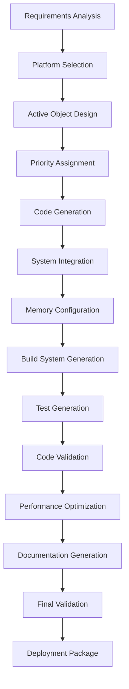

# AI Agent Guide for QP-QK SDK

## Overview

This guide provides comprehensive instructions for AI agents to develop microcontroller firmware using the Quantum Platform (QP) framework with the QK preemptive kernel. It includes step-by-step workflows, code generation patterns, and validation procedures specifically designed for autonomous development.

## AI Agent Constraints and Guidelines

### Core Principles
1. **Template-Driven Development**: Always use provided templates as starting points
2. **Validation-First Approach**: Validate all generated code before proceeding
3. **Documentation-Complete**: Generate comprehensive documentation for all code
4. **Test-Integrated**: Include testing from the beginning of development
5. **Platform-Aware**: Respect hardware limitations and capabilities
6. **Safety-Critical Ready**: Follow patterns suitable for safety-critical applications

### Technical Constraints
- **QK Kernel Rules**: All Active Objects must use non-blocking, Run-to-Completion semantics
- **Memory Management**: Use only static memory allocation and event pools
- **Priority Assignment**: Follow Rate Monotonic Analysis principles
- **Timing Constraints**: Ensure all event handlers complete within maximum RTC time
- **Error Handling**: Implement comprehensive error detection and graceful degradation

## Development Workflow

### Phase 1: Project Analysis and Setup

#### Step 1.1: Requirements Analysis
```yaml
# AI Agent Task: Analyze project requirements
requirements_analysis:
  inputs:
    - Project specification document
    - Hardware platform details
    - Performance requirements
    - Safety/regulatory constraints
  
  outputs:
    - Active Object identification
    - Event signal definitions  
    - Priority assignments
    - Timing constraints
    - Memory requirements
  
  validation_criteria:
    - All functional requirements mapped to Active Objects
    - Real-time constraints are feasible
    - Memory budget within platform limits
    - Priority assignment follows RMA principles
```

#### Step 1.2: Platform Selection
```python
# Template: Platform selection script
def select_platform(requirements):
    """
    AI Agent function to select appropriate platform
    """
    platform_options = {
        'stm32f4': {
            'flash': 512, 'ram': 128, 'freq': 168,
            'peripherals': ['uart', 'spi', 'i2c', 'adc', 'timer'],
            'suitable_for': ['motor_control', 'communication', 'sensors']
        },
        'esp32': {
            'flash': 4096, 'ram': 520, 'freq': 240,
            'peripherals': ['wifi', 'bluetooth', 'uart', 'spi', 'i2c'],
            'suitable_for': ['iot', 'wireless', 'data_logging']
        },
        'msp430': {
            'flash': 128, 'ram': 16, 'freq': 16,
            'peripherals': ['uart', 'spi', 'adc', 'timer'],
            'suitable_for': ['low_power', 'simple_control', 'sensors']
        }
    }
    
    # AI selection logic
    selected = evaluate_platform_requirements(requirements, platform_options)
    return validate_platform_selection(selected, requirements)
```

#### Step 1.3: Project Structure Generation
```bash
# AI Agent Script: Generate project structure
#!/bin/bash

PROJECT_NAME=$1
PLATFORM=$2
TEMPLATE_DIR="templates/platforms/$PLATFORM"

# Create project directory structure
mkdir -p $PROJECT_NAME/{src,inc,build,tests,docs}

# Copy platform-specific templates
cp $TEMPLATE_DIR/main.c $PROJECT_NAME/src/
cp $TEMPLATE_DIR/project_template.h $PROJECT_NAME/inc/
cp $TEMPLATE_DIR/bsp.c $PROJECT_NAME/src/
cp $TEMPLATE_DIR/Makefile $PROJECT_NAME/

# Generate project-specific configuration
python tools/generators/config_generator.py \
    --project $PROJECT_NAME \
    --platform $PLATFORM \
    --output $PROJECT_NAME/inc/project_config.h
```

### Phase 2: Active Object Design

#### Step 2.1: Active Object Identification
```python
# AI Agent: Identify Active Objects from requirements
def identify_active_objects(requirements):
    """
    Extract Active Objects from system requirements
    """
    patterns = {
        'sensor_reader': {
            'keywords': ['sensor', 'read', 'adc', 'measurement'],
            'characteristics': ['periodic', 'data_producer'],
            'template': 'sensor_ao_template'
        },
        'controller': {
            'keywords': ['control', 'pid', 'regulate', 'algorithm'],
            'characteristics': ['periodic', 'data_processor'],
            'template': 'controller_ao_template'
        },
        'communication': {
            'keywords': ['uart', 'spi', 'i2c', 'can', 'protocol'],
            'characteristics': ['event_driven', 'data_handler'],
            'template': 'comm_ao_template'
        },
        'user_interface': {
            'keywords': ['display', 'led', 'button', 'hmi'],
            'characteristics': ['event_driven', 'user_interaction'],
            'template': 'ui_ao_template'
        }
    }
    
    active_objects = []
    for req in requirements:
        ao_type = classify_requirement(req, patterns)
        if ao_type:
            ao = create_active_object_spec(req, patterns[ao_type])
            active_objects.append(ao)
    
    return validate_active_object_design(active_objects)
```

#### Step 2.2: Priority Assignment
```python
# AI Agent: Assign priorities using RMA
def assign_priorities(active_objects):
    """
    Assign priorities based on Rate Monotonic Analysis
    """
    # Sort by frequency (higher frequency = higher priority)
    sorted_aos = sorted(active_objects, 
                       key=lambda ao: ao.frequency, 
                       reverse=True)
    
    priority = len(sorted_aos)
    for ao in sorted_aos:
        ao.priority = priority
        priority -= 1
    
    # Validate schedulability
    utilization = calculate_utilization(sorted_aos)
    if utilization > 0.69:  # RMA bound
        raise ValueError("System not schedulable under RMA")
    
    return sorted_aos
```

#### Step 2.3: Code Generation
```python
# AI Agent: Generate Active Object code
def generate_active_object(ao_spec):
    """
    Generate complete Active Object implementation
    """
    # Load templates
    header_template = load_template('active_objects/active_object_template.h')
    source_template = load_template('active_objects/active_object_template.c')
    
    # Generate substitution dictionary
    substitutions = {
        'AO_NAME_UPPER': ao_spec.name.upper(),
        'AO_NAME_LOWER': ao_spec.name.lower(),
        'AO_NAME': ao_spec.name,
        'AO_DESCRIPTION': ao_spec.description,
        'GENERATION_DATE': datetime.now().isoformat(),
        'SIGNAL_BASE': ao_spec.signal_base,
        'MAX_RTC_TIME': ao_spec.max_rte_time,
        'QUEUE_LENGTH': ao_spec.queue_length,
        'FREQUENCY': ao_spec.frequency,
        'DEADLINE': ao_spec.deadline,
        'PRIORITY': ao_spec.priority
    }
    
    # Perform template substitution
    header_code = substitute_template(header_template, substitutions)
    source_code = substitute_template(source_template, substitutions)
    
    # Generate state machine based on behavior specification
    state_machine = generate_state_machine(ao_spec.behavior)
    source_code = insert_state_machine(source_code, state_machine)
    
    # Validate generated code
    validate_generated_code(header_code, source_code, ao_spec)
    
    return header_code, source_code
```

### Phase 3: System Integration

#### Step 3.1: Event System Design
```python
# AI Agent: Design event system
def design_event_system(active_objects):
    """
    Design comprehensive event system for all Active Objects
    """
    events = {}
    
    # Generate events for each Active Object
    for ao in active_objects:
        # Control events
        events.update(generate_control_events(ao))
        
        # Data events
        events.update(generate_data_events(ao))
        
        # Error events
        events.update(generate_error_events(ao))
    
    # Generate published events (one-to-many)
    published_events = identify_published_events(active_objects)
    events.update(published_events)
    
    # Validate event system
    validate_event_system(events, active_objects)
    
    return events
```

#### Step 3.2: Memory Pool Configuration
```python
# AI Agent: Configure memory pools
def configure_memory_pools(active_objects, events):
    """
    Calculate and configure memory pools for optimal performance
    """
    event_sizes = analyze_event_sizes(events)
    event_frequencies = analyze_event_frequencies(active_objects)
    
    pools = {
        'small': {
            'size': max(e.size for e in event_sizes if e.size <= 16),
            'count': calculate_pool_size(event_frequencies, 'small')
        },
        'medium': {
            'size': max(e.size for e in event_sizes if 16 < e.size <= 64),
            'count': calculate_pool_size(event_frequencies, 'medium')
        },
        'large': {
            'size': max(e.size for e in event_sizes if e.size > 64),
            'count': calculate_pool_size(event_frequencies, 'large')
        }
    }
    
    # Validate memory requirements against platform limits
    total_memory = sum(p['size'] * p['count'] for p in pools.values())
    validate_memory_requirements(total_memory)
    
    return pools
```

#### Step 3.3: Main Application Generation
```python
# AI Agent: Generate main application
def generate_main_application(project_spec):
    """
    Generate complete main.c with all Active Objects
    """
    template = load_template('platforms/stm32f4/main.c')
    
    # Generate Active Object storage
    ao_storage = generate_ao_storage_declarations(project_spec.active_objects)
    
    # Generate startup sequence
    startup_sequence = generate_ao_startup_sequence(project_spec.active_objects)
    
    # Generate QS configuration
    qs_config = generate_qs_configuration(project_spec.active_objects)
    
    # Substitute into template
    substitutions = {
        'ACTIVE_OBJECT_STORAGE_DECLARATIONS': ao_storage,
        'ACTIVE_OBJECT_START_SEQUENCE': startup_sequence,
        'QS_SIGNAL_DICTIONARY_ENTRIES': qs_config,
        'INTERRUPT_CONFIGURATION': generate_interrupt_config(project_spec)
    }
    
    main_code = substitute_template(template, substitutions)
    
    # Validate main application
    validate_main_application(main_code, project_spec)
    
    return main_code
```

### Phase 4: Testing and Validation

#### Step 4.1: Unit Test Generation
```python
# AI Agent: Generate unit tests
def generate_unit_tests(active_object):
    """
    Generate comprehensive unit tests for Active Object
    """
    test_template = load_template('tests/unit_test_template.c')
    
    tests = []
    
    # Test initial transition
    tests.append(generate_initial_test(active_object))
    
    # Test each state
    for state in active_object.states:
        tests.append(generate_state_test(state))
    
    # Test each event
    for event in active_object.events:
        tests.append(generate_event_test(event))
    
    # Test error conditions
    tests.append(generate_error_tests(active_object))
    
    # Test timing constraints
    tests.append(generate_timing_tests(active_object))
    
    test_code = substitute_template(test_template, {
        'AO_NAME': active_object.name,
        'TEST_CASES': '\n'.join(tests)
    })
    
    return test_code
```

#### Step 4.2: Integration Test Generation  
```python
# AI Agent: Generate integration tests
def generate_integration_tests(project_spec):
    """
    Generate integration tests for the complete system
    """
    tests = []
    
    # Test Active Object communication
    tests.append(generate_communication_tests(project_spec.active_objects))
    
    # Test timing and scheduling
    tests.append(generate_timing_tests(project_spec))
    
    # Test fault tolerance
    tests.append(generate_fault_tests(project_spec))
    
    # Test resource usage
    tests.append(generate_resource_tests(project_spec))
    
    return tests
```

#### Step 4.3: Code Validation
```python
# AI Agent: Validate generated code
def validate_generated_code(project_spec):
    """
    Comprehensive validation of all generated code
    """
    validations = [
        validate_qk_compliance,
        validate_timing_constraints,
        validate_memory_usage,
        validate_priority_assignment,
        validate_event_system,
        validate_state_machines,
        validate_error_handling,
        validate_coding_standards
    ]
    
    results = []
    for validation in validations:
        result = validation(project_spec)
        results.append(result)
        
        if not result.passed:
            log_validation_error(result)
            if result.severity == 'error':
                raise ValidationError(result.message)
    
    return all(r.passed for r in results)
```

## Code Generation Templates

### Active Object Generation Template
```python
class ActiveObjectGenerator:
    """AI Agent class for generating Active Objects"""
    
    def __init__(self, template_path):
        self.template_path = template_path
        self.patterns = load_design_patterns()
    
    def generate(self, specification):
        """Generate complete Active Object from specification"""
        
        # Validate specification
        self.validate_specification(specification)
        
        # Select appropriate pattern
        pattern = self.select_pattern(specification)
        
        # Generate state machine
        state_machine = self.generate_state_machine(specification, pattern)
        
        # Generate event handlers
        event_handlers = self.generate_event_handlers(specification)
        
        # Generate helper functions
        helpers = self.generate_helper_functions(specification)
        
        # Combine into complete Active Object
        ao_code = self.combine_components(
            state_machine, event_handlers, helpers
        )
        
        # Validate generated code
        self.validate_generated_code(ao_code, specification)
        
        return ao_code
    
    def select_pattern(self, specification):
        """Select appropriate design pattern"""
        if specification.type == 'periodic':
            return self.patterns['periodic_task']
        elif specification.type == 'event_driven':
            return self.patterns['event_processor']
        elif specification.type == 'state_machine':
            return self.patterns['hierarchical_state_machine']
        else:
            return self.patterns['generic']
```

### Build System Generation
```python
def generate_build_system(project_spec):
    """Generate complete build system for project"""
    
    # Generate Makefile
    makefile = generate_makefile(project_spec)
    
    # Generate linker script
    linker_script = generate_linker_script(project_spec.platform)
    
    # Generate build configuration
    build_config = generate_build_config(project_spec)
    
    # Generate deployment scripts
    deploy_scripts = generate_deployment_scripts(project_spec)
    
    return {
        'Makefile': makefile,
        'linker.ld': linker_script,
        'build_config.h': build_config,
        'deploy.sh': deploy_scripts
    }
```

## Error Detection and Handling

### Validation Framework
```python
class CodeValidator:
    """AI Agent code validation framework"""
    
    def __init__(self):
        self.rules = load_validation_rules()
        self.checkers = {
            'qk_compliance': QKComplianceChecker(),
            'timing': TimingChecker(),
            'memory': MemoryChecker(),
            'safety': SafetyChecker()
        }
    
    def validate(self, code, specification):
        """Comprehensive code validation"""
        
        results = ValidationResults()
        
        # Syntax and semantic checks
        results.add(self.check_syntax(code))
        results.add(self.check_semantics(code, specification))
        
        # QK-specific checks
        results.add(self.checkers['qk_compliance'].check(code))
        
        # Timing constraint checks
        results.add(self.checkers['timing'].check(code, specification))
        
        # Memory usage checks  
        results.add(self.checkers['memory'].check(code, specification))
        
        # Safety-critical checks
        results.add(self.checkers['safety'].check(code))
        
        return results
```

### Common Error Patterns and Solutions
```python
ERROR_PATTERNS = {
    'blocking_call': {
        'pattern': r'(HAL_Delay|while\s*\([^)]*\)\s*{[^}]*}|scanf|gets)',
        'message': 'Blocking calls not allowed in QK Active Objects',
        'solution': 'Replace with asynchronous event-driven pattern',
        'severity': 'error'
    },
    
    'shared_state': {
        'pattern': r'extern\s+(?!const)[^;]+;',
        'message': 'Shared mutable state detected',
        'solution': 'Encapsulate in Active Object and use events',
        'severity': 'warning'
    },
    
    'long_rte': {
        'pattern': r'for\s*\([^)]*;\s*[^<>!=]*[<>]=?\s*\d{4,}',
        'message': 'Potentially long Run-to-Completion detected',
        'solution': 'Break into smaller chunks with event-based continuation',
        'severity': 'warning'
    },
    
    'dynamic_memory': {
        'pattern': r'(malloc|free|new|delete)',
        'message': 'Dynamic memory allocation detected',
        'solution': 'Use static memory pools and QF_NEW/QF_DELETE',
        'severity': 'error'
    }
}
```

## Performance Optimization

### AI Agent Optimization Framework
```python
class PerformanceOptimizer:
    """AI Agent performance optimization"""
    
    def optimize_project(self, project_spec):
        """Optimize entire project for performance"""
        
        optimizations = []
        
        # Priority optimization
        optimizations.append(self.optimize_priorities(project_spec))
        
        # Memory optimization
        optimizations.append(self.optimize_memory(project_spec))
        
        # Event system optimization
        optimizations.append(self.optimize_events(project_spec))
        
        # Code optimization
        optimizations.append(self.optimize_code(project_spec))
        
        return self.apply_optimizations(optimizations)
    
    def optimize_priorities(self, project_spec):
        """Optimize Active Object priorities"""
        
        # Analyze task characteristics
        tasks = analyze_task_characteristics(project_spec.active_objects)
        
        # Apply Rate Monotonic Analysis
        rma_priorities = apply_rma(tasks)
        
        # Check for priority inversions
        inversions = detect_priority_inversions(rma_priorities)
        
        # Resolve inversions
        optimized_priorities = resolve_inversions(rma_priorities, inversions)
        
        return optimized_priorities
```

## Documentation Generation

### Automatic Documentation
```python
def generate_documentation(project_spec):
    """Generate comprehensive project documentation"""
    
    docs = {}
    
    # Architecture documentation
    docs['architecture.md'] = generate_architecture_doc(project_spec)
    
    # API documentation
    docs['api.md'] = generate_api_doc(project_spec)
    
    # User manual
    docs['user_manual.md'] = generate_user_manual(project_spec)
    
    # Developer guide
    docs['developer_guide.md'] = generate_developer_guide(project_spec)
    
    # Test documentation
    docs['test_plan.md'] = generate_test_documentation(project_spec)
    
    return docs
```

## AI Agent Workflow Summary

### Complete Development Process


### Success Criteria
- All generated code compiles without errors or warnings
- Timing constraints validated through static analysis
- Memory usage within platform limits
- All unit tests pass
- Integration tests demonstrate correct system behavior
- Documentation is complete and accurate
- Code follows QK design patterns and best practices
- System is ready for deployment and testing

This guide provides AI agents with the complete framework needed to develop professional microcontroller firmware using the QP-QK SDK. By following these patterns and workflows, AI agents can generate robust, real-time embedded systems that meet industrial standards.