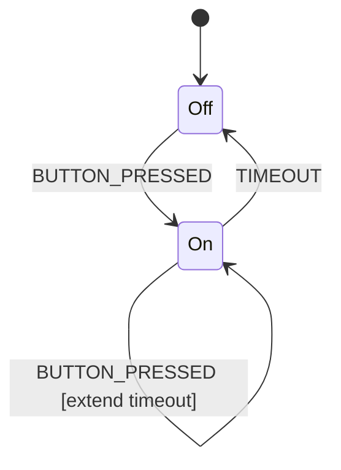

# GitHub.dev Visual State Machine Editor Proposal

## Overview

This document proposes using GitHub.dev (web-based VS Code) as a platform for creating a web-based visual state machine editor for the QP-QK SDK, addressing the Phase 1 requirement for modern visual development tools.

## GitHub.dev Capabilities

### Advantages
- **Zero Installation**: Instant access by pressing "." on any GitHub repo
- **Free Platform**: No hosting costs or infrastructure needed
- **Familiar Environment**: VS Code interface developers already know
- **Git Integration**: Direct commit/push capabilities
- **Extension Support**: Can run web-compatible VS Code extensions
- **Collaborative**: Multiple developers can work on same repo

### Limitations
- **Browser-Only**: No terminal, debugging, or compilation
- **No Backend**: Cannot run QM tool or compilers directly
- **Web Extensions Only**: Limited to JavaScript/TypeScript extensions
- **Resource Constraints**: Browser memory and processing limits

## Proposed Implementation Strategy

### Option 1: Mermaid-Based State Machine Editor (Quick Win)

Create a VS Code web extension that:
1. **Visual Editing**: Use Mermaid state diagrams for visualization
2. **Code Generation**: Convert Mermaid to QP state machine code
3. **Two-Way Sync**: Parse existing QP code to generate diagrams



**Pros**: 
- Mermaid is already supported in GitHub markdown
- Pure JavaScript, works perfectly in browser
- Quick to implement

**Cons**:
- Limited to Mermaid's visualization capabilities
- Not as feature-rich as dedicated state machine tools

### Option 2: Custom Visual Editor Extension (Recommended)

Develop a comprehensive web extension using modern web technologies:

#### Architecture
```
┌─────────────────────────────────────────┐
│     QP Visual Editor Extension          │
│  ┌─────────────────────────────────┐   │
│  │   Visual Editor (React/Vue)     │   │
│  │  - Drag & drop state creation   │   │
│  │  - Transition editing           │   │
│  │  - Hierarchical state support   │   │
│  └─────────────┬───────────────────┘   │
│                │                        │
│  ┌─────────────┴───────────────────┐   │
│  │   State Machine Model (JSON)    │   │
│  │  - QP-compatible structure      │   │
│  │  - Git-friendly format          │   │
│  └─────────────┬───────────────────┘   │
│                │                        │
│  ┌─────────────┴───────────────────┐   │
│  │   Code Generator                │   │
│  │  - QP/C code generation         │   │
│  │  - QM file export               │   │
│  └─────────────────────────────────┘   │
└─────────────────────────────────────────┘
```

#### Key Features
1. **Visual State Machine Designer**
   - Canvas-based drag-and-drop interface
   - Hierarchical state machine support
   - Real-time preview of generated code
   - Zoom, pan, and layout tools

2. **Model Format**
   ```json
   {
     "stateMachine": {
       "name": "Blinky",
       "initialState": "Off",
       "states": [
         {
           "name": "Off",
           "entry": "BSP_ledOff()",
           "exit": null,
           "transitions": [
             {
               "event": "TIMEOUT",
               "target": "On",
               "guard": null,
               "action": null
             }
           ]
         }
       ]
     }
   }
   ```

3. **Code Generation**
   - Generate QP/C and QP/C++ code
   - Export to QM-compatible format
   - Template-based generation

4. **Integration Features**
   - Live sync with code files
   - GitHub Actions integration for build/test
   - Documentation generation

### Option 3: XState-Based Visual Editor

Leverage XState's existing ecosystem:
1. **Use XState Visualizer**: Modern, web-native state machine library
2. **QP Adapter**: Convert between XState and QP formats
3. **Benefits**: Mature tooling, active community, simulation support

## Implementation Plan

### Phase 1: Proof of Concept (2-4 weeks)
1. Create basic Mermaid-based extension
2. Implement simple state machine visualization
3. Generate basic QP code structure

### Phase 2: Custom Editor (2-3 months)
1. Build visual canvas component
2. Implement state machine model
3. Create code generation engine
4. Add QM compatibility layer

### Phase 3: Advanced Features (1-2 months)
1. Hierarchical state support
2. Simulation capabilities
3. Debugging integration
4. AI assistant features

## Technical Implementation

### Extension Structure
```
qp-visual-editor/
├── package.json          # Extension manifest
├── src/
│   ├── extension.ts      # Extension entry point
│   ├── webview/          # React/Vue app
│   │   ├── editor.tsx    # Visual editor component
│   │   ├── model.ts      # State machine model
│   │   └── generator.ts  # Code generation
│   ├── commands/         # VS Code commands
│   └── providers/        # Document providers
├── media/                # Static assets
└── templates/            # Code templates
```

### Key Technologies
- **Frontend**: React or Vue.js for the visual editor
- **State Management**: MobX or Vuex
- **Visualization**: D3.js or Cytoscape.js
- **Code Generation**: Handlebars or similar template engine

## Integration with QP-QK SDK

### Workflow
1. **Design**: Create state machine visually in GitHub.dev
2. **Generate**: Export to QP code and project structure
3. **Build**: Use GitHub Actions to compile and test
4. **Deploy**: Download artifacts or flash via web tools

### File Structure
```
my-project/
├── models/
│   └── blinky.qpsm       # Visual model (JSON)
├── src/
│   └── blinky.c          # Generated code
├── .github/
│   └── workflows/
│       └── build.yml     # CI/CD pipeline
└── README.md
```

## Alternative: GitHub Codespaces

For full development capabilities:
- **Full VS Code**: Complete IDE with terminal
- **QM Tool Support**: Can run desktop QM
- **Compilation**: Full toolchain support
- **Cost**: Requires GitHub subscription

## Recommendations

1. **Start with Option 1**: Quick Mermaid-based prototype
2. **Evolve to Option 2**: Build custom editor based on learnings
3. **Consider Codespaces**: For professional teams needing full IDE
4. **Open Source**: Make extension available to community

## Benefits Over Desktop QM

1. **No Installation**: Instant access from any browser
2. **Collaboration**: Real-time multi-user editing
3. **Version Control**: Native Git integration
4. **Modern UI**: Web-based, responsive design
5. **AI Integration**: Easy to add AI features
6. **Cross-Platform**: Works on any OS with a browser

## Challenges and Mitigations

| Challenge | Mitigation |
|-----------|------------|
| Browser limitations | Use web workers for heavy processing |
| Code generation complexity | Server-side generation via GitHub Actions |
| QM compatibility | Import/export converters |
| Performance with large models | Virtualization and lazy loading |

## Conclusion

GitHub.dev provides a viable platform for creating a modern web-based visual state machine editor. By developing a custom VS Code web extension, we can deliver a zero-installation, collaborative visual editor that complements the existing QM desktop tool while providing modern features essential for AI agents and cloud-first development teams.

The recommended approach is to start with a simple Mermaid-based solution and evolve toward a full-featured custom editor, maintaining compatibility with existing QP tools throughout.