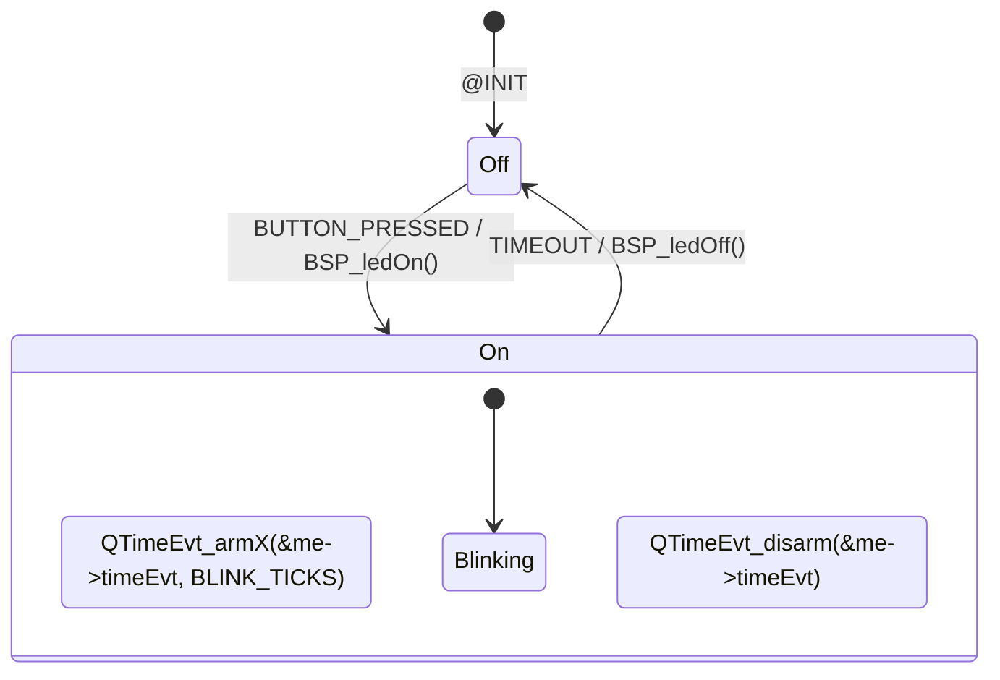

# VS Code Extension Evaluation for Visual State Machine Editor

## Executive Summary

After analyzing existing VS Code extensions and GitHub.dev capabilities, **Mermaid** emerges as the optimal foundation for creating a web-based visual state machine editor for the QP-QK SDK. This document evaluates available options and provides implementation recommendations.

## Evaluation Results

### 🏆 Winner: Mermaid-Based Solution

**Why Mermaid is the Best Choice:**
1. **100% Browser Compatible** - Pure JavaScript, no server needed
2. **GitHub Native Support** - Renders automatically in markdown files
3. **Existing Extensions** - Multiple mature extensions available
4. **Open Source** - Can fork and extend
5. **Active Development** - Regular updates and community support

### Extension Comparison Matrix

| Extension | Web Compatible | Open Source | State Machines | QP Support | Ease of Extension |
|-----------|---------------|-------------|----------------|------------|-------------------|
| **Mermaid Chart** | ✅ Yes | ✅ Yes | ✅ Yes | ❌ No | ⭐⭐⭐⭐⭐ |
| XState VSCode | ⚠️ Maybe | ✅ Yes | ✅ Yes | ❌ No | ⭐⭐⭐ |
| Power FSM Viewer | ❌ No | ✅ Yes | ✅ Yes | ❌ No | ⭐⭐⭐ |
| PlantUML | ❌ No | ✅ Yes | ✅ Yes | ❌ No | ⭐⭐ |
| QM Tool | ❌ No | ❌ No | ✅ Yes | ✅ Yes | ⭐ |

## Recommended Implementation Path

### Phase 1: Mermaid QP Extension (4-6 weeks)

Create a fork of Mermaid Chart extension with QP-specific features:

#### 1. Enhanced State Diagram Syntax


#### 2. Code Generation Features
- Parse Mermaid diagrams to QP state machine code
- Generate complete Active Object implementations
- Export to QM-compatible format

#### 3. Integration Features
- Syntax highlighting for QP-specific keywords
- IntelliSense for QP events and actions
- Live preview with generated code

### Phase 2: Custom Visual Editor (2-3 months)

Build upon the Mermaid foundation:

#### Architecture
```
qp-mermaid-extension/
├── src/
│   ├── extension.ts          # Main extension entry
│   ├── parser/
│   │   ├── mermaidToQp.ts   # Mermaid → QP converter
│   │   ├── qpToMermaid.ts   # QP → Mermaid converter
│   │   └── qmImporter.ts    # QM file import
│   ├── generator/
│   │   ├── activeObject.ts  # AO code generation
│   │   ├── stateMachine.ts  # HSM code generation
│   │   └── templates/       # Code templates
│   ├── preview/
│   │   └── webview.ts       # Visual preview
│   └── language/
│       └── qpMermaid.ts     # Language definition
├── syntaxes/
│   └── qp-mermaid.json      # Syntax highlighting
└── package.json
```

#### Key Features to Add
1. **QP-Specific Diagram Elements**
   - Hierarchical state notation
   - Guard conditions
   - Internal transitions
   - History states

2. **Code Generation Templates**
   ```typescript
   // Template for state handler
   QState ${stateName}(${aoName} * const me, QEvt const * const e) {
       QState status_;
       switch (e->sig) {
           case Q_ENTRY_SIG: {
               ${entryAction}
               status_ = Q_HANDLED();
               break;
           }
           case ${eventName}: {
               ${transitionAction}
               status_ = Q_TRAN(&${targetState});
               break;
           }
           default: {
               status_ = Q_SUPER(&${parentState});
               break;
           }
       }
       return status_;
   }
   ```

3. **Visual Enhancements**
   - Drag-and-drop state creation
   - Transition routing
   - Zoom and pan controls
   - Export to SVG/PNG

### Phase 3: Advanced Integration (1-2 months)

#### 1. GitHub Actions Integration
```yaml
name: Generate QP Code
on:
  push:
    paths:
      - '**/*.qp.mmd'  # QP Mermaid files
jobs:
  generate:
    runs-on: ubuntu-latest
    steps:
      - uses: actions/checkout@v3
      - name: Generate QP Code
        uses: qp-qk-sdk/mermaid-to-qp@v1
        with:
          input: '**/*.qp.mmd'
          output: 'generated/'
```

#### 2. AI Assistant Features
- Natural language to state machine conversion
- Suggest optimizations
- Detect common patterns

## Alternative Approaches

### Option B: XState Foundation
- **Pros**: Modern, feature-rich, active community
- **Cons**: Requires significant adaptation for QP semantics
- **Effort**: High (3-4 months)

### Option C: Build from Scratch
- **Pros**: Complete control, optimal for QP
- **Cons**: High effort, reinventing the wheel
- **Effort**: Very High (4-6 months)

## Implementation Roadmap

### Month 1: Foundation
- [ ] Fork Mermaid Chart extension
- [ ] Add QP-specific syntax extensions
- [ ] Basic code generation

### Month 2: Core Features  
- [ ] Complete state machine parser
- [ ] Full code generation
- [ ] QM file compatibility

### Month 3: Enhanced UI
- [ ] Visual editor improvements
- [ ] Debugging integration
- [ ] Documentation

### Month 4: Integration
- [ ] GitHub Actions
- [ ] AI features
- [ ] Community release

## Technical Considerations

### Browser Limitations
- **Solution**: Use web workers for heavy processing
- **Code Generation**: Keep templates lightweight
- **Storage**: Use IndexedDB for larger models

### Performance
- **Large Diagrams**: Implement virtualization
- **Real-time Preview**: Debounce updates
- **Memory**: Limit undo/redo history

### Compatibility
- **QM Files**: Provide import/export converters
- **Legacy Code**: Support reverse engineering
- **Version Control**: Use diff-friendly formats

## Success Metrics

1. **Adoption**: 1000+ installs in 6 months
2. **Performance**: < 100ms diagram updates
3. **Compatibility**: 100% QM feature parity
4. **User Satisfaction**: 4.5+ star rating

## Conclusion

By building upon the Mermaid ecosystem, we can deliver a powerful web-based visual state machine editor that:
- Works seamlessly in GitHub.dev
- Provides modern developer experience
- Maintains compatibility with QP/QM tools
- Enables AI agent integration

The recommended approach balances development effort with feature richness, providing a path to quickly deliver value while building toward a comprehensive solution.

## Next Steps

1. **Prototype**: Create proof-of-concept Mermaid extension (1 week)
2. **Validate**: Test with QP community (2 weeks)
3. **Develop**: Build full extension (8-12 weeks)
4. **Release**: Publish to VS Code Marketplace

## Resources

- [Mermaid Chart Extension](https://github.com/Mermaid-Chart/vscode-mermaid-chart)
- [VS Code Extension API](https://code.visualstudio.com/api)
- [Mermaid State Diagrams](https://mermaid.js.org/syntax/stateDiagram.html)
- [QP State Machine Patterns](https://www.state-machine.com/qp)